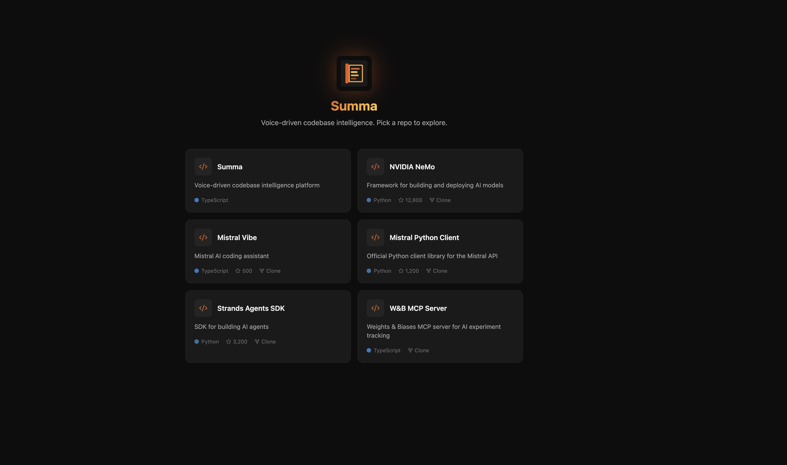
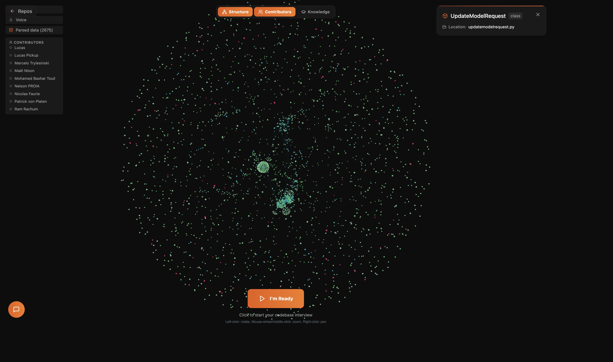

# Summa

**Voice-driven codebase intelligence. Talk to your code. Understand what you ship.**

**[Try it live](https://mistral-worldwide-hackathon-26.vercel.app/)**

Built solo by [Guust Goossens](https://github.com/guustgoossens) at the [Mistral Worldwide Hackathon](https://mistral.ai) in Paris, February 28 to March 1, 2026. Selected from 7,000+ global applicants, 100 participants per city, near the Eiffel Tower.




---

## The Story

The night I got accepted into the Mistral hackathon, I couldn't sleep. At 2:00 AM, an idea hit me and wouldn't let go.

I had seen a project that parses codebases into Abstract Syntax Trees and renders them as 2D graphs. It was beautiful. You could actually *see* the structure of code. But I kept thinking: what if you combined that with a real graph database? What if you could *talk* to it? What if you could walk away from your desk and still understand the code your AI agent just wrote?

41% of all code is now AI-generated. The [METR study](https://metr.org) (July 2025) showed that developers using AI tools were actually 19% slower, yet they *believed* they were 24% faster. There's a growing gap between the code we ship and the code we understand. Every time you wait for an LLM to generate tokens, your brain goes idle. That's dead time. That's cognitive offloading.

I wanted to turn that dead time into active learning.

I had been wanting to learn about graphs for a long time. I brought *Designing Data-Intensive Applications* with me to the hackathon to brush up. What I discovered over 34 hours was that graphs are a fundamentally better primitive for reasoning about code in an AI-native world. Trees are great for parsing, but code is a graph. Functions call functions, files import files, people contribute to overlapping systems. Graphs capture that reality.


---

## What It Does

Summa turns any codebase into a living 3D knowledge graph you can explore and talk to.

1. **Drop in a repo.** Tree-sitter parses the code into an AST, extracts files, functions, classes, imports, and call chains, then loads everything into KuzuDB, an embedded graph database running in-browser via WebAssembly

2. **Enrich with git data.** Git history analysis maps who contributed what, when, and how much. Contributors become invisible infrastructure nodes in the graph, queryable but not cluttering the view

3. **Talk to it.** Start a voice session powered by ElevenLabs Conversational AI and Mistral. The AI interviews you about the codebase, evaluates your understanding, and gives real-time feedback

4. **Get quizzed.** A knowledge quiz system targets parts of the codebase you haven't engaged with. Your answers update UNDERSTANDS relationships in the graph, building a map of who knows what

5. **See the knowledge map.** Four overlay modes reveal different dimensions of the same graph:
   - **Structure**: code architecture at a glance (files, functions, call chains)
   - **Contributors**: who built what, ownership patterns, stale code
   - **Knowledge**: green = understood, red = knowledge gap, yellow = surface only
   - **People**: the full human topology around code, knowledge silos made visible




---

## Why I Built This

### The Problem

AI coding tools help machines understand your code. Nobody is helping *you* understand your code.

Code output is no longer limited by how fast your fingers type. It's limited by the tokens per second of an LLM. That fundamentally changes the bottleneck. The constraint isn't writing anymore. The constraint is understanding. And if you don't understand what you're shipping, you've lost control.

I think we need to give up some control to move fast with AI. But we don't have to give up *oversight*. ASTs and graphs are a way to maintain that oversight. To see the shape of your code, who's responsible for what, and where understanding breaks down.

### The Bigger Picture

This isn't just a developer tool. The same approach works for:

- **Engineering managers** who need to know who understands which systems, who's a single point of failure, and what happens when someone leaves
- **Onboarding**: new engineers take 3-6 months to build mental models that Summa can surface in minutes
- **Bus factor analysis**: the average team has 15-20% of its codebase understood by only one person
- **Any domain with complex interconnected knowledge**: law, medicine, research, compliance

### A Healthier Way to Code

This is something I feel strongly about. Software engineering shouldn't mean being screen-locked 12 hours a day. With voice-driven interaction, engineers can take a walk, plug in AirPods, and have a dynamic conversation about their codebase instead of staring at a monitor writing repetitive patterns.

It's more active thinking, less repetitive typing. More conversation, less boilerplate. Research on [cognitive offloading](https://en.wikipedia.org/wiki/Cognitive_offloading) shows that over-reliance on external tools erodes critical thinking. Summa flips that. It uses AI to *engage* your brain instead of replacing it.

I think this is genuinely healthier for engineers.

---

## Agents & Models

Summa uses a multi-agent architecture where each agent has a specific role, latency budget, and Mistral model selection.

### Mistral Models

All intelligence in Summa is powered by **Mistral AI**:

| Agent | Model | Parameters | Speed | Role |
|-------|-------|-----------|-------|------|
| **Interview Agent** | DevStral Small 2 | 24B | ~200 tokens/s, <2s latency | Voice conversation, pre-computed briefing, interview flow |
| **Quiz System** | DevStral Small 2 | 24B | ~200 tokens/s, <2s latency | Question generation, answer evaluation, knowledge scoring |
| **Graph Reasoner** | DevStral 2 | 123B | ~76 tokens/s, 5-15s | Multi-step Cypher reasoning with progressive disclosure (L0 -> L1 -> L2) |
| **Metadata Enricher** | DevStral Small 2 | 24B | batch | Node summaries (L0), relationship summaries (L1), relevance scoring |

The **two-speed architecture** is deliberate: the 24B model handles all real-time voice interaction (fast enough for natural conversation), while the 123B model handles deep background analysis where latency is hidden.

### How the Interview Works

```
User clicks "I'm Ready"
    |
    +-- gatherContext(): 6 parallel KuzuDB Cypher queries (browser, <100ms)
    +-- generateBriefing(): Mistral DevStral Small 2 (JSON mode, 2-5s)
    +-- briefing stored on proxy as system message
    |
User clicks "Start Interview"
    |
    +-- ElevenLabs voice session starts
    |   Mistral generates responses, no tool calls, pure conversation
    |
Interview complete --> optional "Quiz Me" (independent knowledge hook)
```

### Graph Reasoner (Multi-Step Analysis)

For complex questions like *"who should fix this auth bug?"*, the Graph Reasoner runs a multi-step agent loop:

1. **L0**: Fetch node summaries (50-token overview per node)
2. **L1**: Fetch relationship summaries (contributor history, knowledge scores)
3. **L2**: Deep dive into specific commit history and interview transcripts
4. Loop detection prevents repeated queries. Max 8 reasoning steps.

---

## Sponsor Integration

### Mistral AI (Primary)

Every LLM call in Summa goes through Mistral. Two model tiers (DevStral Small 2 for voice, DevStral 2 for deep analysis) demonstrate Mistral's versatility across the latency/capability spectrum. The proxy server forwards all requests to the Mistral API in an OpenAI-compatible format.

I also integrated **voxtral.c**, [antirez](https://github.com/antirez)'s pure-C inference engine for Mistral's **Voxtral Mini 4B Realtime** model. It runs locally on Apple Silicon via Metal at ~2.5x real-time speed with zero Python dependencies. Browser audio is captured via AudioWorklet, streamed as PCM16LE over WebSocket, and text tokens come back in real time. This enables a parallel local STT stream alongside ElevenLabs.

### ElevenLabs

Voice is the primary interaction mode. Summa uses ElevenLabs Conversational AI with a custom LLM integration (Mistral via the proxy), React SDK (`useConversation`), and low-latency streaming TTS. The full voice roundtrip from speech to response is ~1.5-2.5 seconds.

### KuzuDB

The graph database runs entirely in the browser via WebAssembly, no server needed. Agents compose Cypher queries dynamically instead of calling pre-defined functions. This is the key architectural choice: give the agent one tool (`query_graph(cypher)`) and it can answer any question about the codebase by writing the right query.

A separate native KuzuDB instance powers the MCP server for integration with coding tools like Claude Code and Cursor.

### AWS (Bedrock)

The proxy server supports dual-mode inference: `INFERENCE_PROVIDER=mistral` (default) or `INFERENCE_PROVIDER=bedrock`. AWS Bedrock provides an alternative inference path using the AWS SDK `ConverseCommand`. I had several interesting conversations at the hackathon with AWS representatives about enterprise AI deployment patterns and the challenges companies face when trying to integrate AI into existing workflows.

---

## Hackathon Conversations

One of the best parts of this hackathon was the conversations. People from **Zed** were very interested in graph-based code visualization as a primitive for code editors. We even discussed the concept of graph-native coding languages centered around graphs instead of syntax trees. People from **Unaite** shared insights about how graph representations could transform knowledge management at scale.

The common thread in all these conversations: graphs are a fundamentally better primitive for an AI-native world. Trees capture syntax. Graphs capture relationships. And relationships are what matter when you're trying to understand a codebase, or anything else.

---

## Research That Shaped This

| Finding | Source |
|---------|--------|
| Developers using AI tools are **19% slower** but believe they're 24% faster | METR study, July 2025 |
| **41%** of all code is now AI-generated | GitHub / industry reports, 2025 |
| Only **29%** of developers trust AI-generated code accuracy (down from 40%) | Developer surveys, 2025 |
| AI enables cognitive offloading, reducing deep thinking engagement | Cognitive science research |
| Average team has **15-20%** of codebase understood by only one person | Bus factor analysis |
| New engineers take **3-6 months** to build codebase mental models | Industry standard |

---

## Architecture

```
+-----------------------------------------------------+
|                    Browser (React + Vite)            |
|                                                      |
|  +-----------+  +-----------+  +------------------+  |
|  | Tree-sitter|  | KuzuDB   |  | react-force-     |  |
|  | WASM       |->| WASM     |->| graph-3d         |  |
|  | (parsing)  |  | (Cypher) |  | (Three.js)       |  |
|  +-----------+  +-----------+  +------------------+  |
|        ^              ^  |            ^              |
|        |              |  |            |              |
|   [repo files]        |  |    [3D visualization     |
|                       |  |     updates]              |
|                       |  |            |              |
|  +--------------------+--+------------+-----------+  |
|  |   ElevenLabs useConversation() hook            |  |
|  |   + Voice controls + Quiz panel                |  |
|  +------------------------------------------------+  |
|                        |  ^                          |
+------------------------+--+--------------------------+
                         |  |
                  WebSocket/WebRTC
                         |  |
               +---------v--+----------+
               |   ElevenLabs Cloud    |
               |   (STT + TTS +        |
               |    turn-taking)       |
               +---------+------------+
                         |
                Custom LLM endpoint
                         |
               +---------v------------+
               |  Express Proxy       |
               |  (localhost:3001)    |
               |  + Briefing storage  |
               |  + Voxtral WS       |
               +---------+------------+
                         |
               +---------v------------+
               |  Mistral API         |
               |  or AWS Bedrock      |
               +----------------------+
```

### Data Flow

1. **Parse.** Tree-sitter extracts AST from source code (multi-language: TypeScript, JavaScript, Python, Java, Go, Rust, C, C++)
2. **Analyze.** Git history analysis maps contributors, commit frequency, line ownership
3. **Load.** Data ingested into KuzuDB WASM (File, Function, Class, Person nodes + relationships)
4. **Enrich.** AI generates summaries and relevance scores for all nodes
5. **Visualize.** KuzuDB queries derive `{ nodes, links }` for the 3D force-directed graph
6. **Interact.** Voice sessions, quizzes, and overlay toggles drive real-time graph updates

### Graph Schema (KuzuDB)

**Node tables:** `File`, `Function`, `Class`, `Person`, `Discussion`

**Relationship tables:** `CONTAINS`, `CALLS`, `IMPORTS`, `INHERITS`, `CONTRIBUTED`, `UNDERSTANDS`, `HAS_PARTICIPANT`, `ABOUT`

Person nodes are invisible infrastructure. They exist for powerful Cypher relationship queries but don't render in the default 3D view. They surface through overlay modes.

---

## Tech Stack

| Layer | Technology | Why |
|-------|-----------|-----|
| Frontend | React 19 + Vite 6 + Tailwind CSS v4 | Fast, modern, hot reload |
| 3D Visualization | react-force-graph-3d (Three.js) | Force-directed graph out of the box |
| Graph Database | KuzuDB WASM | In-browser Cypher queries, no server |
| Voice | ElevenLabs Conversational AI SDK | Full voice agent pipeline |
| Local STT | voxtral.c (Voxtral Mini 4B Realtime) | Pure-C, Apple Silicon Metal, ~2.5x real-time |
| LLM | Mistral (DevStral Small 2 + DevStral 2) | Two-speed: voice + deep analysis |
| Code Parsing | web-tree-sitter (WASM) | Language-agnostic AST |
| Git Analysis | simple-git | Contributor mapping |
| Proxy | Express 5 | ElevenLabs <-> Mistral bridge |
| MCP Server | KuzuDB native + MCP SDK | Claude Code / Cursor integration |
| Infrastructure | AWS Bedrock (optional) | Alternative inference path |

---

## Getting Started

### Prerequisites

- [Bun](https://bun.sh) (or Node.js 20+)
- Mistral API key
- ElevenLabs account + agent ID (for voice features)

### Setup

```bash
git clone https://github.com/guustgoossens/hackstral.git
cd hackstral
bun install
```

Create `.env.local`:

```env
MISTRAL_API_KEY=your_key
VITE_ELEVENLABS_AGENT_ID=your_agent_id
VITE_PROXY_URL=http://localhost:3001

# Optional
INFERENCE_PROVIDER=mistral          # or bedrock
AWS_BEARER_TOKEN_BEDROCK=your_token
ENRICHER_MODEL=devstral-small-2507
REASONER_MODEL=devstral-2507
```

### Run

```bash
bun run dev:all       # Frontend (localhost:5173) + proxy (localhost:3001)
```

### Analyze a Repository

```bash
bun run parse         # Tree-sitter AST -> graph.json
bun run git-analyze   # Git history -> git-data.json
bun run enrich -- public/data/hackstral   # AI summaries + relevance scores
```

### Other Commands

```bash
bun run dev           # Vite dev server only
bun run dev:server    # Express proxy only
bun run build         # TypeScript check + production build
bun run lint          # TypeScript + ESLint
bun run format        # Prettier
bun run mcp -- public/data/hackstral   # KuzuDB MCP Server (stdio)
```

---

## Project Structure

```
src/
  types/graph.ts          # KuzuDB schema + visualization types
  lib/
    kuzu.ts               # KuzuDB WASM init + schema + Cypher helpers
    briefing.ts           # Pre-computed interview briefing pipeline
    graph-builder.ts      # Tree-sitter AST -> KuzuDB
    git-data.ts           # Git data -> KuzuDB
    agent-tools.ts        # ElevenLabs client tools
  hooks/
    useGraph.ts           # Graph state + overlay mode
    useKuzu.ts            # KuzuDB lifecycle
    useInterview.ts       # Interview lifecycle (idle -> ready -> interviewing -> complete)
    useVoiceAgent.ts      # ElevenLabs voice connection
    useKnowledge.ts       # Quiz system + knowledge scores
  components/
    Layout.tsx            # App shell + overlay toggles
    Graph3D.tsx           # 3D force graph wrapper
    VoiceControls.tsx     # Mic button + transcript + interview controls
    NodeDetail.tsx        # Selected node panel
    QuizPanel.tsx         # Quiz UI
server/
  proxy.ts                # Mistral/Bedrock API proxy + briefing storage
  mcp/                    # KuzuDB MCP server (stdio transport)
  enricher/               # L0 node summaries + L1 relationship summaries
  reasoner/               # Multi-step Cypher reasoning agent
scripts/
  parse-repo.ts           # Tree-sitter AST -> graph.json
  git-analyze.ts          # Git history -> git-data.json
docs/                     # Full documentation
```

---

## The Vision

I'm obsessed with startups. I want to build a tech company, and I believe Summa could be one.

### The Open-Source Path

The core of Summa should be open source, maintained by a community, free for local use, running KuzuDB embedded in your browser. Parse your own repos, talk to your own code, track your own understanding. No data leaves your machine.

### The Enterprise Path

For teams and companies, a cloud version changes the equation:

- **Neo4j** instead of KuzuDB, hosted, battle-tested, built for scale
- **Central dashboard** for engineering managers to see who understands what across the entire organization
- **Real-time team knowledge mapping**: when someone leaves, immediately see which systems are at risk
- **Continuous enrichment**: as code changes, the graph updates, knowledge assessments trigger automatically

Companies want to move fast with AI but they can't afford to lose control. Summa gives them speed with oversight. They'd pay for that.

### Why This Works as a Business

The companies spending millions on AI consultants to "become AI-native" are failing because their data isn't organized. You can't deploy intelligent agents on a mess. Summa organizes codebases into graph-structured knowledge bases that are navigable by both humans and AI. That's infrastructure. Infrastructure compounds.

---

## Challenges

- **ElevenLabs tool round-trip**: The original design had the voice agent composing Cypher queries in real time during conversation. ElevenLabs' Custom LLM tool calling has a round-trip through their servers that failed intermittently. We pivoted to pre-computed briefings, losing some magic but gaining 100% reliability. The fix is documented in `docs/architecture/ARCHITECTURE_CHANGES.md`.

- **KuzuDB WASM setup**: SharedArrayBuffer requires COOP/COEP headers. Getting this right with Vite's dev server and eventual deployment took careful configuration.

- **Balancing depth vs. demo**: Solo hackathon means ruthless scoping. The 4-agent architecture was designed but only the Interview Agent and Quiz System made it to full implementation. The Graph Reasoner and Background Enricher exist as working server-side components.

---

## What I Learned

- **Graphs are a better primitive.** For code, for knowledge, for team dynamics. Trees capture syntax. Graphs capture relationships. Once you see a codebase as a graph, you can't unsee it.

- **Progressive disclosure is everything.** You can't dump a full codebase on someone. L0 summaries (50 tokens) -> L1 relationship context -> L2 full detail. This pattern works for both humans and AI agents.

- **Voice changes the interaction model.** When you can talk to your code, you think differently. It's more active, more conversational, more like learning from a colleague than reading documentation.

- **The hackathon conversations were as valuable as the code.** People from Zed talking about graph-native programming languages. People from Unaite discussing graph-based knowledge management. The ideas in this space go far beyond what I built in 34 hours.

---

## Acknowledgments

- **Mistral AI** for hosting the hackathon, the API credits, and building the models that power Summa
- **ElevenLabs** for the Conversational AI platform and credits
- **KuzuDB** for making an embedded graph database that runs in WebAssembly
- **AWS** for Bedrock access and insightful conversations about enterprise AI deployment
- **antirez** for voxtral.c, a beautiful piece of C that makes local Mistral STT possible
- **GitNexus** (abhigyanpatwari) for proving that Tree-sitter + KuzuDB works in-browser
- Everyone at the hackathon who got excited about graphs and knowledge

---

## Built With

- [Mistral AI](https://mistral.ai): DevStral Small 2, DevStral 2, Voxtral Mini 4B Realtime
- [ElevenLabs](https://elevenlabs.io): Conversational AI, TTS
- [KuzuDB](https://kuzudb.com): Embedded graph database (WASM + native)
- [AWS Bedrock](https://aws.amazon.com/bedrock/): Alternative inference provider
- [React](https://react.dev) + [Vite](https://vite.dev) + [Tailwind CSS](https://tailwindcss.com)
- [Three.js](https://threejs.org) via react-force-graph-3d
- [Tree-sitter](https://tree-sitter.github.io/tree-sitter/): Code parsing
- [voxtral.c](https://github.com/antirez/voxtral.c): Local STT inference
- TypeScript throughout

---

*Built in 34 hours at the Mistral Worldwide Hackathon, Paris. February 28 to March 1, 2026.*
